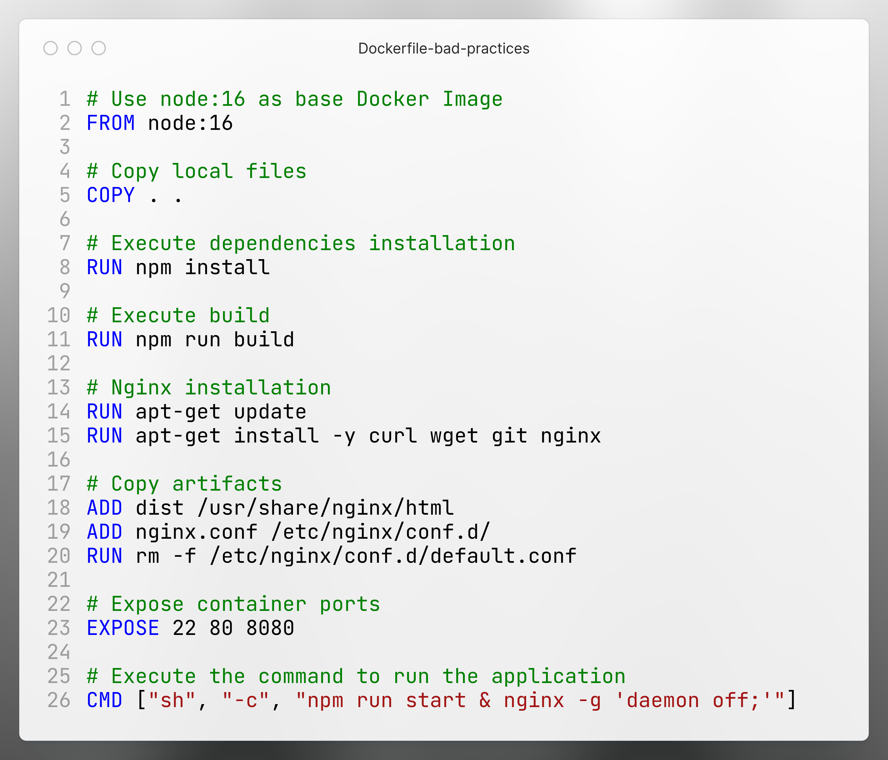

# Start with Docker `build`, `run`, `inspect`, `logs`

---

## Introduction

In this guide, you will:

- Build the image.
- Launch a simple web application.
- Explore the:
  - `docker build` command.
  - `docker run` command.
  - `docker inspect` command.
  - `docker logs` command.

---

## Step 1: Create Dockerfile and Customized `index.html`

**Create a `Dockerfile`:**

```dockerfile
# Use node:16 as base Docker Image
FROM node:16

# Copy local files
COPY . .

# Execute dependencies installation
RUN npm install

# Execute build
RUN npm run build

# Nginx installation
RUN apt-get update
RUN apt-get install -y curl wget git nginx

# Copy artifacts
ADD dist /usr/share/nginx/html
ADD nginx.conf /etc/nginx/conf.d/
RUN rm -f /etc/nginx/conf.d/default.conf

# Expose container ports
EXPOSE 22 80 8080

# Execute the command to run the application
CMD ["sh", "-c", "npm run start & nginx -g 'daemon off;'"]
```

**Create a simple `index.html`:**

```html
<!DOCTYPE html>
<html lang="en">
  <head>
    <meta charset="utf-8">
    <meta http-equiv="X-UA-Compatible" content="IE=edge">
    <meta name="viewport" content="width=device-width,initial-scale=1.0">
    <link rel="icon" href="<%= BASE_URL %>favicon.ico">
    <title>KMS Healthcare</title>
  </head>
  <body>
    <noscript>
      <strong>We're sorry but play doesn't work properly without JavaScript enabled. Please enable it to continue.</strong>
    </noscript>
    <div id="app"></div>
    <!-- built files will be auto injected -->
  </body>
</html>
```
---

## Step 2: Build Docker Image and Run It

```bash
# Change directory
cd $(git rev-parse --show-toplevel)/a00-Start

# Build the Docker image
docker build -t demo0-start:v1 -f Dockerfile .

# Run the Docker container
docker run -d -p 8080:80 --name demo0-start demo0-start:v1
```

Access the application in your browser http://localhost:8080

---

<details>
<summary><h2>Step 3: Install jq Package</h2></summary>

`jq` is a lightweight and flexible command-line JSON processor, useful for parsing JSON output from commands like `docker inspect`.

**For macOS:**

```bash
brew install jq
jq --version
```

**For Linux (Ubuntu/Debian):**

```bash
sudo apt-get update
sudo apt-get install jq
jq --version
```

**For Linux (CentOS/RHEL):**

```bash
sudo yum install epel-release
sudo yum install jq
jq --version
```

**For Linux (Fedora):**

```bash
sudo dnf install jq
jq --version
```

**For Other Linux Distributions:**

```bash
wget -O jq https://github.com/jqlang/jq/releases/download/jq-1.7.1/jq-linux-amd64
chmod +x ./jq
sudo mv jq /usr/local/bin
jq --version
```

**For Windows (Using Chocolatey):**

```bash
choco install jq
jq --version
```

**For Windows (Manual Install):**

1. Download the executable from [jq Releases](https://github.com/stedolan/jq/releases).
2. Choose `jq-win64.exe` (or `jq-win32.exe` for 32-bit systems).
3. Rename the downloaded file to `jq.exe`.
4. Move it to a folder in your system's PATH (e.g., `C:\Windows`).
</details>

---

## Step 4: Docker Image Inspect Commands

Use `docker inspect` to retrieve detailed information about Docker images.

```bash
# Inspect the Docker image
docker image inspect demo0-start:v1

# Get the creation date of the Docker image
docker inspect --format='{{.Created}}' demo0-start:v1

# Get the Docker image labels (formatted with jq)
docker image inspect --format='{{json .Config}}' demo0-start:v1 | jq
```

---

## Step 5: Docker Container Inspect Commands

Use `docker inspect` to retrieve detailed information about Docker containers.

```bash
# Inspect the Docker container
docker inspect demo0-start

# Get the IP address of the container
docker inspect --format='{{.NetworkSettings.IPAddress}}' demo0-start

# Inspect container state (running, paused, stopped)
docker inspect --format='{{.State.Status}}' demo0-start

# Inspect exposed ports
docker inspect --format='{{json .Config.ExposedPorts}}' demo0-start

# Inspect network details of the container (formatted with jq)
docker inspect --format='{{json .NetworkSettings}}' demo0-start | jq
```

## Step 6: Docker Container Logs

#### Using Commands

```bash
# View log with basic
docker logs demo0-start

# View log with follow flag
docker logs -f demo0-start

# View log with follow flag combines with tail
docker logs -f --tail 10 demo0-start
```

## Step 7: Stop and Remove Container and Images

```bash
# Stop and remove the container
docker rm -f demo0-start

# Keep the image "demo0-start:v1" for next demo
# docker rmi demo0-start:v1
```

## Conclusion

#### Dockerfile analysis


